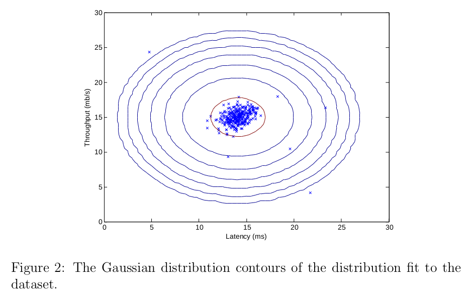
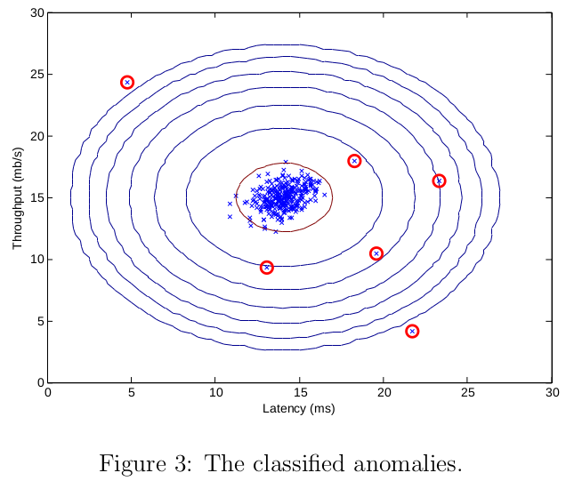
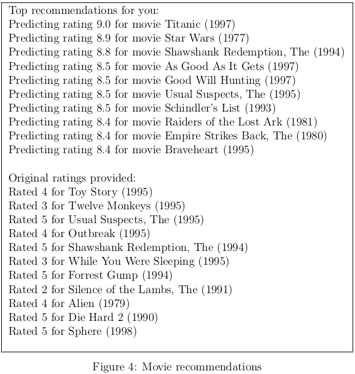

# Machine Learning Models
## Introduction :
> Why do we need Machine Learning? 

The question is why do we need Machine Learning over the conventional Logical Programming Languages? 
To answer the above question let us consider some limitations of Logical Programming. 
- We cannot program a computer to perform Natural tasks because in real life there are just too many variables to consider. 
e.g.:- Let us consider the problem of Handwriting Recognition, 

Every individual has their way of writing. The handwriting of a person may differ from others significantly, even if we try to hardwire the program it will lead to very poor performance. 
- We did not know how to code a computer to perform Natural tasks. 
- Poor Performance 
Even if we did logically program a computer for performing Natural tasks it leads to very poor performance. 

> Applications of Machine Learning 

Machine Learning has numerous applications in real life, here are some of them :-
- Autonomous Vehicles(Autonomous Cars, Helicopters).
- Face Recognition(Smartphones, Security Systems)
- Self customizing programs(Amazon, Netflix, Spotify).
- Natural Language Processing(Siri, Google Assistant, Alexa).
- Computer Vision.
- Fraud Detection(Credit Card Fraud Detection Systems).
- Anomaly Detection(Faulty Products in a Manufacturing).

> What is Machine Learning?

- According to Arthur Samuel(1959) Machine Learning is defined as:-  __"Field of study that gives computers the ability to learn without being explicitly programmed".__
- According to Tom Michel (1999) Machine Learning is defined as:- __"A computer program is said to learn from experience E with respect to some class of tasks T and performance measure P, if its performance at tasks in T, as measured by P, improves with experience E."__
- There are 3 types of Machine Learning Algorithms. 
    1. Supervised Learning - 
     Teach the computer how to do something, then let it use it's new found knowledge to perform the task.
    2. Unsupervised Learning - 
     Let the computer learn how to do something, and use this to determine structure and patterns in data.
    3. Reinforcement learning
     Teach the computer how to do something, by rewarding it when it maximizes output.

___
Language used in Models - __MATLAB__ 
Algorithm used -
1. Supervised Learning
    - Linear Regression
    - Logistic Regression
    - Neural Network
    - Support Vector Machine
2. Unsupervised Learning
    - K-means Clustering Algorithm
    - Principle Component Analysis
    - Collaborative filtering
    - Anomaly Detection Algorithm
___
## Models
**Note : Run files with name starting from "main" to execute the project!.** 
1. **Predicting Profits as a function of Population.** 
__About Dataset__ - 
- The dataset consists of profits for a food truck with population from various cities. 
- Attributes/Columns in data: 2 
- Attribute Information: 
  1. population size in 10,000s 
  2. profit in $10,000s 
- The dataset is available in .txt file 

 

- We used linear Regression with Gradient Descent to find the plane/line that minimizes the  squared error cost function on train data.

- Error Reduction with Weights visualization, Contour Plot.
 
**Note : To know more refer to this PDF [Exercise 1.pdf](https://github.com/kushagra414/Machine-Learning-Models/blob/master/pdfs/ex1.pdf)**

___

2. **Predicting whether an applicant will be admitted in University with given marks.** 
   __About Dataset__ - 
- The dataset consists of data from previous applicants. 
- Attributes/Columns in data: 3 
- Attribute Information: 
  1. Marks in 1st exam 
  2. Marks in 2nd exam 
  3. Whether the applicant was Admitted in University or not.(as 0 and 1).
- The dataset is available in .txt file 

 

- We used logistic regression with Gradient Descent to find the plane/line that minimizes the squared error cost function on train data. 
 
**Note : To know more refer to this PDF [Exercise 2.pdf](https://github.com/kushagra414/Machine-Learning-Models/blob/master/pdfs/ex2.pdf)**

___

3. **Recognizing handwritten digits (from 0 to 9) using logistic Regression and Neural Networks.** 
   __About Dataset__ - 
- The dataset consists of 5000 training examples where each example is 20 pixel by 20 pixel grayscale image of the digit. 
- Attributes/Columns in data: 400 
- Each pixel represents an attribute. 
- The dataset is available in .mat file which can be easily loaded in MATLAB/Octave environment 

 
1. First, We will use Logistic Regression(OneVsAll) to classify the Handwritten Images.
2. We will Neural Network with 3 Layers to classify the handwritten images while only using feedforward propagation. 
 
**Note : To know more refer to this PDF [Exercise 3.pdf](https://github.com/kushagra414/Machine-Learning-Models/blob/master/pdfs/ex3.pdf)**

___

4. **Recognizing handwritten digits (from 0 to 9) using Neural Networks.** 
   __About Dataset__ - 
- The dataset consists of 5000 training examples where each example is 20 pixel by 20 pixel grayscale image of the digit. 
- Attributes/Columns in data: 400 
- Each pixel represents an attribute. 
- The dataset is available in .mat file which can be easily loaded in MATLAB/Octave environment 

 
- We will Neural Network with 3 Layers to classify the handwritten images while only using feedforward propagation with backpropagation algorithm to learn the parameters for the neural network and improve its performance. 
 
**Note : To know more refer to this PDF [Exercise 4.pdf](https://github.com/kushagra414/Machine-Learning-Models/blob/master/pdfs/ex4.pdf)**

___

5. **Understanding Importance of Regularization and Bias v.s. Variance.** 
   __About Dataset__ - 
- The dataset consists of the change of water level in a reservoir and corresponding amount of water flowing out of a dam. 
- Attributes/Columns in data: 2 
- Attribute Information: 
  1. change of water level in a reservoir. 
  2. amount of water flowing out of a dam. 
- The dataset is available in .mat file which can be easily loaded in MATLAB/Octave environment 

1. First we will try to fit linear regression to our data.
    
    
    As we can see Linear Regression is Underfitting the data, hence we need to increase number of features.
2. Now we will try improving our model by creating Polynomial features.
    
    - After adding Polynomial Features.
    
    
    - As we can see now we are overfitting our model, hence we need to add regularization(λ) term to prevent this.
    - We can select hyperparameter λ by iterating over many λ values and selecting the one where cross validation error is minimum. 
**Note : To know more refer to this PDF [Exercise 5.pdf](https://github.com/kushagra414/Machine-Learning-Models/blob/master/pdfs/ex5.pdf)**

___

6. **Spam Mail Classifier.** 
In processEmail.m, we have implemented the following email preprocessing and normalization steps:-
   - **Lower-casing:**
The entire email is converted into lower case, so
that capitalization is ignored (e.g., IndIcaTE is treated the same as
Indicate).
   - **Stripping HTML:** All HTML tags are removed from the emails.
Many emails often come with HTML formatting; we remove all the
HTML tags, so that only the content remains.
   - **Normalizing URLs:** All URLs are replaced with the text “httpaddr”.
   - **Normalizing Email Addresses:**
with the text “emailaddr”.
   - **Normalizing Numbers:**
“number”.
All email addresses are replaced
All numbers are replaced with the text
   - Normalizing Dollars: All dollar signs ($) are replaced with the text
“dollar”.
   - **Word Stemming:** Words are reduced to their stemmed form. For example- 
“discount”, “discounts”, “discounted” and “discounting” are all replaced with “discount”.  Sometimes, the Stemmer actually strips off
additional characters from the end, so “include”, “includes”, “included”,
and “including” are all replaced with “includ”.
   - **Removal of non-words:** Non-words and punctuation have been re-
moved. All white spaces (tabs, newlines, spaces) have all been trimmed
to a single space character. 

An example of a sample email -

- Then we will train the SVM on numeric Vectors we created using clean text. 
**Note : To know more refer to this PDF [Exercise 6.pdf](https://github.com/kushagra414/Machine-Learning-Models/blob/master/pdfs/ex6.pdf)**

___

7. **Implement K-means algorithm and use it for image compression and implement PCA on face data set.** 
- K-means an unsupervised learning Algorithm and we will use it to compress a image. 
- Steps in k-means Algorithm
    - Randomly select centroid
    - Move the centroid towards mean of it's clustered points.
  
- Image Compression using k-means clustering algorithm.
  
- Principle Component Analysis(PCA) Algorithm is used to decrease the dimensions/feature of the data so that we can visualize the data in 2-D or to decrease feature for faster computation.
- Visualizing Data
  
- Plotting Principle Component
  
- Data points Projected on Principle ComponentVisualization
  
- Face Dataset before PCA, there are 1024 feature(each image is 32x32 pixels)
  
- After applying PCA on Face Dataset, features are reduced to 100(Each image became 10x10)
   
**Note : To know more refer to this PDF [Exercise 7.pdf](https://github.com/kushagra414/Machine-Learning-Models/blob/master/pdfs/ex7.pdf)**

___

8. **Anomaly Detection and Recommender System.** 
1. Anomaly Detection System
  - Train Dataset is Unlabelled.
  - CV Dataset is Labelled.
  - In Anomaly detection algorithm we are assuming our data set be Gaussian     Distributed.
    
  - We will find Outliers(Anomalies) in Train Dataset by finding a Threshold from CV Data.
  - We use F1 score to find correct Threshold.
  - After determining Threshold, we will classify Anomalous Servers using the     threshold.
  - Here is an example of Toy Data set which has only 2 features.
    
  - Contour plot of Gaussian Distribution.
    
  - Predicting Anomalies in Train Dataset.
     
2. Recommender System
   __About Dataset__ - 
    - This dataset consists of ratings on a scale of 1 to 5. 
    - Matrix Y of shape no_of_users*no_of_movies, on y-axis --> Movie, on x-axis ---> User and each element of matrix is Rating from 1-5. 
     
    - Matrix R of shape no_of_users*no_of_movies, on y-axis --> Movie, on x-axis ---> User and each element of matrix is movie Rated(1) or not(0). 
     
    - The dataset is available in .mat file which can be easily loaded in MATLAB/Octave environment 
  - We will implement the collaborative filtering learning algorithm and apply it to a dataset of movie ratings. 
  